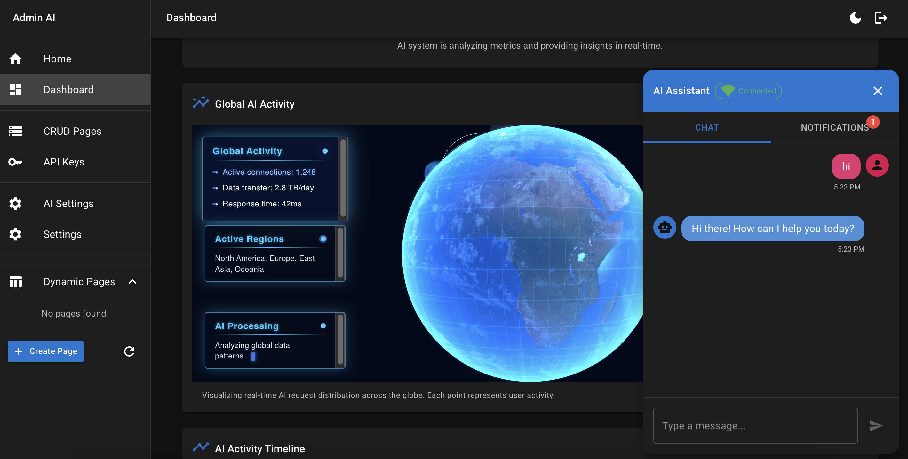
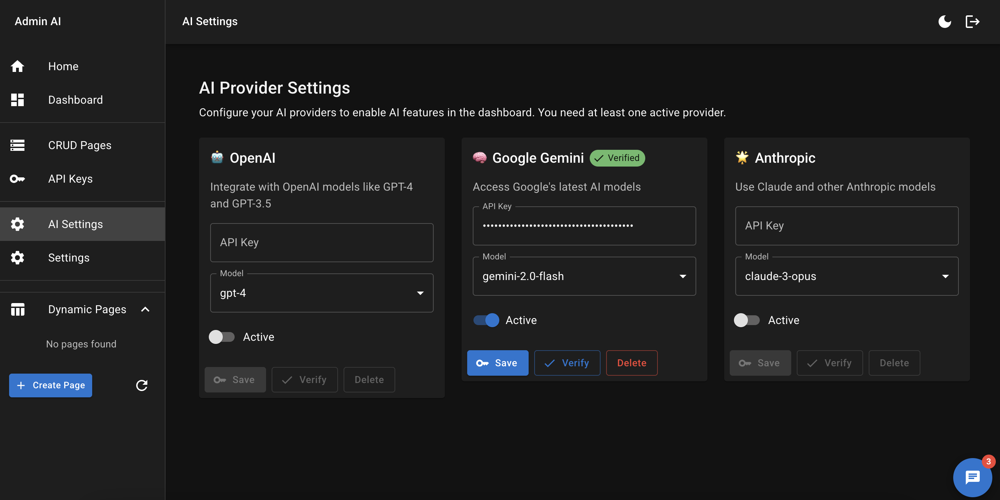

# AdminAI

AdminAI is a modern, AI-powered administration dashboard that combines powerful backend services with an intuitive frontend interface. Built with TypeScript, React, and Node.js, it provides real-time monitoring, analytics, and AI-assisted system management capabilities.



## Features

- 🤖 AI-powered system analysis and recommendations
- 📊 Real-time monitoring and metrics visualization
- 🔄 WebSocket-based real-time communication
- 🎯 Customizable dashboard components
- 🛠 Advanced system management tools
- 🔒 Secure authentication and authorization
- 📱 Responsive design for all devices
- 🔍 Comprehensive metrics and insights
- 🧠 Multiple AI provider integrations

## Tech Stack

### Frontend
- React with TypeScript
- Vite for build tooling
- Three.js for 3D visualizations
- Socket.IO Client for WebSocket communication
- Material-UI components
- Redux for state management

### Backend
- Node.js with TypeScript
- Express.js for API endpoints
- Socket.IO for WebSocket server
- PostgreSQL database
- Redis for caching and session management
- Bull for job queues and background processing
- TypeORM for database operations

## Project Structure

```
.
├── packages/
│   ├── frontend/        # React frontend application
│   ├── backend/         # Node.js backend server
│   └── shared/          # Shared types and utilities
├── docs/               # Documentation
└── README.md          # This file
```

## Getting Started

### Prerequisites

- Node.js 18 or higher
- Yarn package manager
- PostgreSQL 14 or higher
- Redis 6 or higher

### Installation

1. Clone the repository:
   ```bash
   git clone https://github.com/yourusername/admin-ai.git
   cd admin-ai
   ```

2. Install dependencies:
   ```bash
   yarn install
   ```

3. Set up environment variables:
   ```bash
   cp packages/frontend/.env.example packages/frontend/.env
   cp packages/backend/.env.example packages/backend/.env
   ```

4. Start the development servers:
   ```bash
   yarn dev
   ```

The frontend will be available at http://localhost:5173 and the backend at http://localhost:3000.

## Development

### Frontend Development

```bash
cd packages/frontend
yarn dev
```

### Backend Development

```bash
cd packages/backend
yarn dev
```

### Building for Production

```bash
yarn build
```

## Documentation

Detailed documentation is available in the [docs](./docs) directory:

- [Architecture Overview](./docs/architecture.md) - Comprehensive documentation of the system architecture, including frontend and backend structures, communication patterns, data flows, security measures, and deployment options.
  
- [API Documentation](./docs/api.md) - Complete API reference including REST endpoints, WebSocket events, authentication methods, error handling, and rate limiting details.

## Key Features

### Real-time Communication

AdminAI uses WebSockets to provide real-time updates and communication between the client and server. This enables:

- Live system metrics updates
- Real-time AI assistant interactions
- Instant notifications and alerts
- Collaborative features

### AI Integration

The platform integrates with multiple AI providers to offer:

- System performance analysis and recommendations
- Schema and CRUD generation
- Dashboard widget suggestions
- Natural language interactions

### Comprehensive Monitoring

AdminAI provides detailed monitoring capabilities:

- System health metrics
- Request analytics
- Geographic data visualization
- AI usage statistics
- Performance and security insights

## Contributing

1. Fork the repository
2. Create your feature branch (`git checkout -b feature/amazing-feature`)
3. Commit your changes (`git commit -m 'Add some amazing feature'`)
4. Push to the branch (`git push origin feature/amazing-feature`)
5. Open a Pull Request

## License

This project is licensed under the MIT License - see the [LICENSE](LICENSE) file for details.

## Support

For support, please open an issue in the GitHub repository or contact the maintainers. 